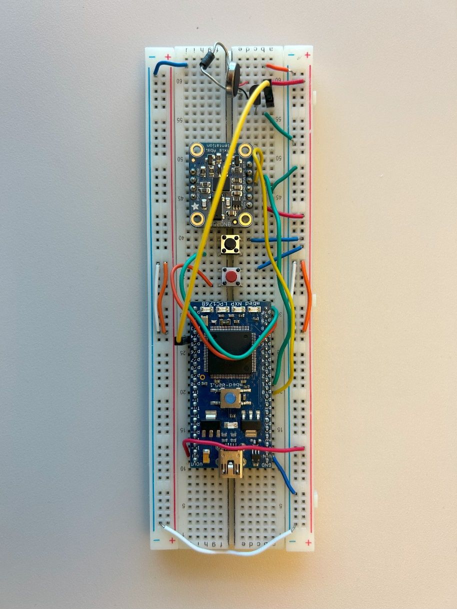
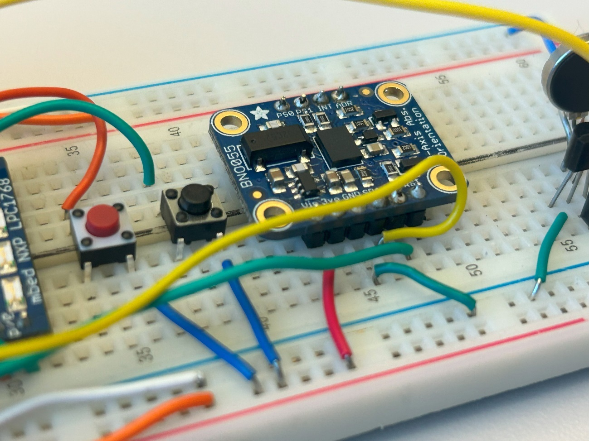
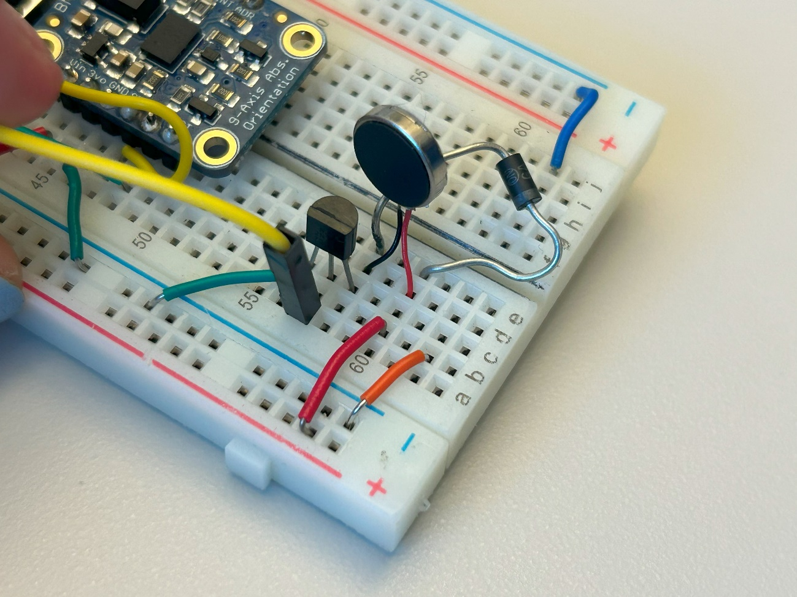

# ECE 4180 Final Design Project – IMU Pencil

Repo of our final project in ECE 4180, for Fall 2023

Team Members: Elio Zebinato, Christopher Semali, Mae Frank

**Georgia Institute of Technology**

Watch our presentation and demo:

Presentation: <https://drive.google.com/file/d/14KUnDt1Ti68P850mrDOKhtqP7hBQmZFL/view?usp=drive_link>

Demo: <https://docs.google.com/presentation/d/1ax4yqrgerWUf8rvh5xPlwQ1ZmiABBNkj/edit?usp=sharing&ouid=108049071814918597007&rtpof=true&sd=true>

These are images of our IMU Pencil breadboard from several angles:

****

****

****

****

**Table of Contents**

[Project Idea](#project-idea)

[Parts List](#parts-list)

[Schematic and Diagrams](#schematic-and-diagrams)

[Source Code](#source-code)

[Future Improvements](#future-improvements)

## Project Idea

Our IMU pencil is a new Mbed hardware I/O interface and developing a Unity VS C\# application. The Mbed is connected to a PC that runs the C\# programs with the Unity display. Due to our knowledge from previous labs, we used an I2C IMU for user-imperceptible localization. IMU captures the effects of movement on its inertial frame of reference. The benefits of using the IMU for tracking user movement of the pencil are that it is not reliant on wireless-based localization and does not require a transmitter-receiver pair to work. The IMU has a high sampling rate that results in accurate tracking of movement - however, it is known to have a drifting error as the time of tracking increases. Due to the limited time of the project, we did not have time to fully address this issue, but it is useful to keep this in mind. The GUI will be developed on Unity’s application with VS C\# programs; it will be built on the .NET Framework like the projects created in Lab 5. Our GUI will display the IMU movement as a “drawing” on the PC. In addition to the IMU, we will use other parts of our 4180 parts kit including brushed DC motors, a dual motor driver, a DC barrel jack, resistors, and push buttons. One push button does. The other push button does. The purpose of the DC motor and driver is to indicate the power of the pencil, while the barrel jack supplies the motor's power.

## Parts List

-   Mbed LPC1768 (<https://www.sparkfun.com/products/retired/9564>)
-   1k Ohm Resistor (<https://www.sparkfun.com/products/14492>)
-   Adafruit BNO055 IMU (<https://www.adafruit.com/product/2472>)
-   Dual H-Bridge Motor Driver (<https://www.sparkfun.com/products/14450>)
-   DC Barrel Jack Adapter (<https://www.sparkfun.com/products/10811>)
-   Brushed DC Motor (<https://www.sparkfun.com/products/13302>)
-   2 Push Buttons (<https://www.sparkfun.com/products/97>)
-   Jumper Wires (<https://www.sparkfun.com/products/12794>)

## Schematic and Diagrams

\*\*insert System Architecture and Software Flow diagrams\*\*

## Source Code

Mbed Code

// Include --------------------------------------------------------------------

\#include "mbed.h"

\#include "BNO055.h"

// Definition -----------------------------------------------------------------

\#define NUM_LOOP 100

// Object ---------------------------------------------------------------------

static BufferedSerial pc(USBTX, USBRX, 115200);

\#if defined(TARGET_LPC1114)

DigitalOut pwr_onoff(dp17);

I2C i2c(dp5, dp27); // SDA, SCL

// Reset =D7, addr = BNO055_G_CHIP_ADDR, mode = MODE_NDOF \<- as default

BNO055 imu(i2c, dp18);

\#elif defined(TARGET_LPC1768)

DigitalOut pwr_onoff(p30);

I2C i2c(p9, p10); // SDA, SCL

// Reset =D7, addr = BNO055_G_CHIP_ADDR, mode = MODE_NDOF \<- as default

BNO055 imu(i2c, p29);

\#elif defined(TARGET_NUCLEO_L152RE)\\

\|\| defined(TARGET_NUCLEO_F401RE)\\

\|\| defined(TARGET_NUCLEO_F411RE)\\

\|\| defined(TARGET_NUCLEO_F446RE)

\#if 0

DigitalOut pwr_onoff(PB_10);

\#else

DigitalOut pwr_onoff(PA_9);

\#endif

I2C i2c(PB_9, PB_8); // SDA, SCL

\#if 0

// Reset = ??, addr = BNO055_G_CHIP_ADDR, mode = MODE_NDOF \<- as default

BNO055 imu(i2c, PA_8);

\#else

BNO055 imu(PB_9, PB_8, PA_8);

\#endif

TextLCD_I2C_N lcd(&i2c, 0x7c, TextLCD::LCD8x2); // LCD(Akizuki AQM0802A)

\#elif defined(TARGET_RZ_A1H)

DigitalOut pwr_onoff(P8_11);

I2C i2c(P1_3, P1_2); // SDA, SCL

// Reset =D7, addr = BNO055_G_CHIP_ADDR, mode = MODE_NDOF \<- as default

BNO055 imu(i2c, P8_13);

\#else

\#error "Not cheched yet"

\#endif

Timer t;

// RAM ------------------------------------------------------------------------

BNO055_ID_INF_TypeDef bno055_id_inf;

BNO055_EULER_TypeDef euler_angles;

BNO055_QUATERNION_TypeDef quaternion;

BNO055_LIN_ACC_TypeDef linear_acc;

BNO055_GRAVITY_TypeDef gravity;

BNO055_TEMPERATURE_TypeDef chip_temp;

// ROM / Constant data --------------------------------------------------------

// Function prototypes --------------------------------------------------------

//------------------------------------------------------------------------------

// Control Program

//------------------------------------------------------------------------------

// Calibration

// Please refer

// BNO055 Data sheet 3.10 Calibration & 3.6.4 Sensor calibration data

void bno055_calbration(void)

{

uint8_t d;

printf("------ Enter BNO055 Manual Calibration Mode ------\\r\\n");

//---------- Gyroscope Caliblation -----------------------------------------

// (a) Place the device in a single stable position for a period of

// few seconds to allow the gyroscope to calibrate

printf("Step1) Please wait few seconds\\r\\n");

t.start();

while (t.elapsed_time().count() \< 10) {

d = imu.read_calib_status();

printf("Calb dat = 0x%x target = 0x30(at least)\\r\\n", d);

if ((d & 0x30) == 0x30) {

break;

}

ThisThread::sleep_for(1s);

}

printf("-\> Step1) is done\\r\\n\\r\\n");

//---------- Magnetometer Caliblation --------------------------------------

// (a) Make some random movements (for example: writing the number ‘8’

// on air) until the CALIB_STAT register indicates fully calibrated.

// (b) It takes more calibration movements to get the magnetometer

// calibrated than in the NDOF mode.

printf("Step2) random moving (try to change the BNO055 axis)\\r\\n");

t.start();

while (t.elapsed_time().count() \< 30) {

d = imu.read_calib_status();

printf("Calb dat = 0x%x target = 0x33(at least)\\r\\n", d);

if ((d & 0x03) == 0x03) {

break;

}

ThisThread::sleep_for(1s);

}

printf("-\> Step2) is done\\r\\n\\r\\n");

//---------- Magnetometer Caliblation --------------------------------------

// a) Place the device in 6 different stable positions for a period of

// few seconds to allow the accelerometer to calibrate.

// b) Make sure that there is slow movement between 2 stable positions

// The 6 stable positions could be in any direction, but make sure that

// the device is lying at least once perpendicular to the x, y and z axis

printf("Step3) Change rotation each X,Y,Z axis KEEP SLOWLY!!");

printf(" Each 90deg stay a 5 sec and set at least 6 position.\\r\\n");

printf(" e.g. (1)ACC:X0,Y0,Z-9,(2)ACC:X9,Y0,Z0,(3)ACC:X0,Y0,Z9,");

printf("(4)ACC:X-9,Y0,Z0,(5)ACC:X0,Y-9,Z0,(6)ACC:X0,Y9,Z0,\\r\\n");

printf(" If you will give up, hit any key.\\r\\n");

t.stop();

while (true) {

d = imu.read_calib_status();

imu.get_gravity(&gravity);

printf(

"Calb dat = 0x%x target = 0xff ACC:X %4.1f, Y %4.1f, Z %4.1f\\r\\n",

d, gravity.x, gravity.y, gravity.z

);

if (d == 0xff) {

break;

}

if (pc.readable()) {

break;

}

}

if (imu.read_calib_status() == 0xff) {

printf("-\> All of Calibration steps are done successfully!\\r\\n\\r\\n");

} else {

printf("-\> Calibration steps are suspended!\\r\\n\\r\\n");

}

t.stop();

}

int main()

{

uint8_t ser_buf[4];

imu.set_mounting_position(MT_P6);

bno055_calbration();

t.start();

while(true) {

imu.get_quaternion(&quaternion);

printf("%d,%d,%d,%d\\n",

quaternion.x, quaternion.y, quaternion.z, quaternion.w);

}

}

// Diffrent output format as for your reference

\#if 0

int main()

{

uint8_t i;

pwr_onoff = 1;

printf(

"Bosch Sensortec BNO055 test program on " \__DATE_\_ "/" \__TIME_\_ "\\r\\n"

);

// Is BNO055 available?

if (imu.chip_ready() == 0) {

do {

printf("Bosch BNO055 is NOT avirable!!\\r\\n");

pwr_onoff = 0; // Power off

ThisThread::sleep_for(100ms);

pwr_onoff = 1; // Power on

ThisThread::sleep_for(20ms);

} while(imu.reset());

}

imu.set_mounting_position(MT_P6);

printf("AXIS_REMAP_CONFIG:0x%02x, AXIS_REMAP_SIGN:0x%02x\\r\\n",

imu.read_reg0(BNO055_AXIS_MAP_CONFIG),

imu.read_reg0(BNO055_AXIS_MAP_SIGN)

);

imu.read_id_inf(&bno055_id_inf);

printf("CHIP:0x%02x, ACC:0x%02x, MAG:0x%02x,",

bno055_id_inf.chip_id, bno055_id_inf.acc_id, bno055_id_inf.mag_id

);

printf("GYR:0x%02x, , SW:0x%04x, , BL:0x%02x\\r\\n",

bno055_id_inf.gyr_id, bno055_id_inf.sw_rev_id,

bno055_id_inf.bootldr_rev_id

);

while(true) {

printf("Euler Angles data\\r\\n");

for (i = 0; i \< NUM_LOOP; i++) {

imu.get_Euler_Angles(&euler_angles);

printf("Heading:%+6.1f [deg], Roll:%+6.1f [deg],",

euler_angles.h, euler_angles.r,);

printf(" Pich:%+6.1f [deg], \#%02d\\r\\n",

euler_angles.p, i);

ThisThread::sleep_for(500ms);

}

printf("Quaternion data\\r\\n");

for (i = 0; i \< NUM_LOOP; i++) {

imu.get_quaternion(&quaternion);

printf("W:%d, X:%d, Y:%d, Z:%d, \#%02d\\r\\n",

quaternion.w, quaternion.x, quaternion.y, quaternion.z, i);

ThisThread::sleep_for(500ms);

}

printf("Linear accel data\\r\\n");

for (i = 0; i \< NUM_LOOP; i++) {

imu.get_linear_accel(&linear_acc);

printf(

"X:%+6.1f[m/s\*s], Y:%+6.1f[m/s\*s], Z:%+6.1f[m/s\*s], \#%02d\\r\\n",

linear_acc.x, linear_acc.y, linear_acc.z, i

);

ThisThread::sleep_for(500ms);

}

printf("Gravity vector data\\r\\n");

for (i = 0; i \< NUM_LOOP; i++) {

imu.get_gravity(&gravity);

printf(

"X:%+6.1f[m/s\*s], Y:%+6.1f[m/s\*s], Z:%+6.1f[m/s\*s], \#%02d\\r\\n",

gravity.x, gravity.y, gravity.z, i

);

ThisThread::sleep_for(500ms);

}

printf("Chip temperature data\\r\\n");

for (i = 0; i \< (NUM_LOOP / 4); i++) {

imu.get_chip_temperature(&chip_temp);

printf("Acc chip:%+d [degC], Gyr chip:%+d [degC], \#%02d\\r\\n",

chip_temp.acc_chip, chip_temp.gyr_chip, i);

ThisThread::sleep_for(500ms);

}

}

}

\#endif

Unity Code

## Future Improvements

Upon concluding this project. We achieved our main goal of building a “pencil device” with an IMU tracking system of its coordinates; along with the Mbed being able to send the IMU data to the Unity game engine. In the future, we would like to connect the IMU pencil system to Microsoft HoloLens. This will allow the user to fully experience the 3D drawing environment.
