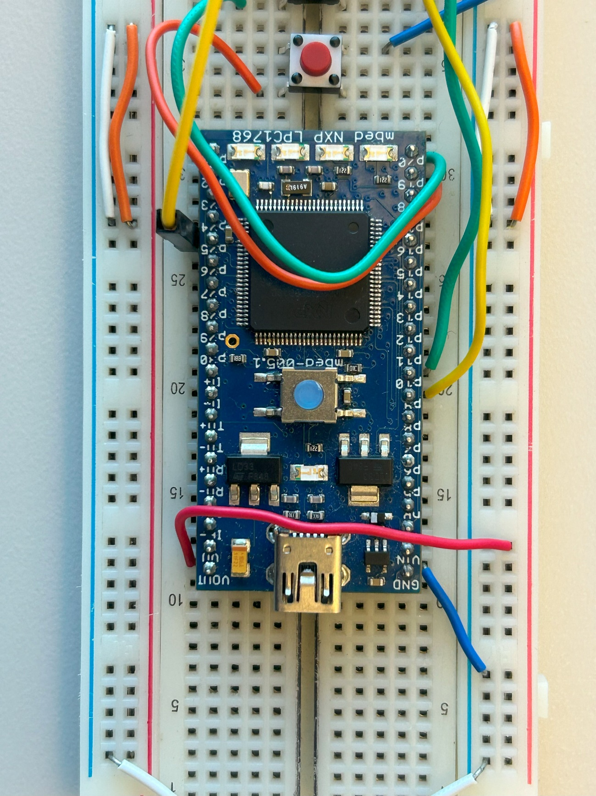
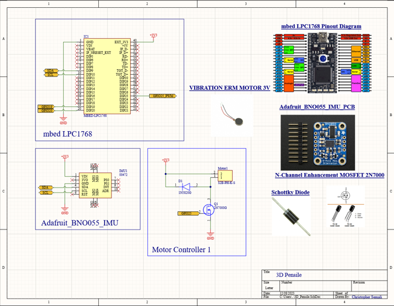
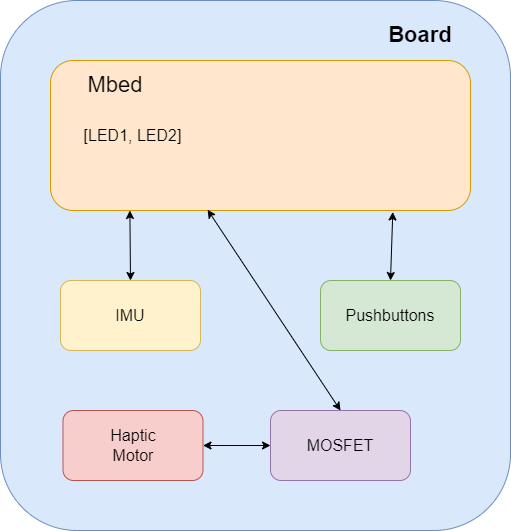
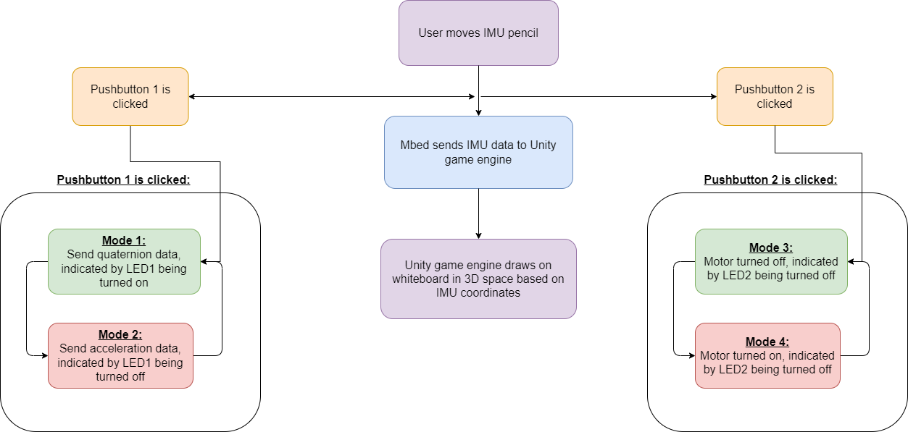

# ECE 4180 Final Design Project – IMU Pencil

Repo of our final project in ECE 4180, for Fall 2023

Team Members: Elio Zebinato, Christopher Semali, Mae Frank

**Georgia Institute of Technology**

Watch our presentation and demo:

Presentation: <https://docs.google.com/presentation/d/1ax4yqrgerWUf8rvh5xPlwQ1ZmiABBNkj/edit?usp=sharing&ouid=108049071814918597007&rtpof=true&sd=true>

Demo: <https://drive.google.com/file/d/14KUnDt1Ti68P850mrDOKhtqP7hBQmZFL/view?usp=drive_link>

These are images of our IMU Pencil breadboard from several angles:





**Table of Contents**

[Project Idea](#project-idea)

[Parts List](#parts-list)

[Schematics and Diagrams](#schematics-and-diagrams)

[Source Code](#source-code)

[Future Improvements](#future-improvements)

## Project Idea

This project is a 3D space pencil that uses a 9-axis IMU to collect orientation data and interfaces with a Unity application built on the .NET Framework to create drawings in 3D space. The Unity application is coded in C\# and uses a serial interface to communicate with the mbed microcontroller used in the hardware system. Using skills gained in this course, an I2C connection was used to sample the IMU at a high frequency for accurate and fast data collection alongside user-imperceptible localization. The IMU captures quaternion data to provide the software with local orientation; however, the ultimate intention for this project would be to estimate the actual velocity and displacement of the board in space. While the high sample rate assists in providing near-real-time data, due to the known issues of the IMU used in this project, multiple errors were encountered, such as high noise and drifting errors with increased time of use. Due to the limited time frame of this project, we did not have time to fully address this issue, but it is useful to keep this in mind. Additional hardware components used included a MOSFET transistor, haptic sensor, diode, mbed microcontroller, and two pushbuttons.

## Parts List

-   Mbed LPC1768 (<https://www.sparkfun.com/products/retired/9564>)
-   Adafruit BNO055 IMU (<https://www.adafruit.com/product/2472>)
-   Transistor 2N3904 NPN (<https://www.sparkfun.com/products/521>)
-   Haptic Motor (<https://media.digikey.com/pdf/Data%20Sheets/Seeed%20Technology/1020-15-003-001_Spec.pdf>)
-   Diode Rectifier (<https://www.sparkfun.com/products/8589>)
-   2 Push Buttons (<https://www.sparkfun.com/products/97>)
-   Jumper Wires (<https://www.sparkfun.com/products/12794>)

## Schematics and Diagrams

Pin Tables

| IMU | Mbed |
|-----|------|
| Vin | 3.3V |
| GND | GND  |
| SDA | p9   |
| SCL | p10  |

| Motor | Mbed |
|-------|------|
| Vin   | 3.3V |
| GND   | GND  |
| PWM   | p21  |

| Pushbutton 1 | Mbed |
|--------------|------|
| Vin          | 3.3V |
| output       | p19  |

| Pushbutton 2 | Mbed |
|--------------|------|
| Vin          | 3.3V |
| output       | p20  |

System Schematics





Software Flow



## Source Code

**Mbed Code**

```
//  Include --------------------------------------------------------------------
#include    "mbed.h"
#include    "BNO055.h"
#include    "PinDetect.h"
#include    "rtos.h"

//  Definition -----------------------------------------------------------------
#define NUM_LOOP    100

//  Object ---------------------------------------------------------------------
static BufferedSerial pc(USBTX, USBRX, 115200);
#if defined(TARGET_LPC1114)
DigitalOut pwr_onoff(dp17);
I2C    i2c(dp5, dp27);   // SDA, SCL
// Reset =D7, addr = BNO055_G_CHIP_ADDR, mode = MODE_NDOF <- as default
BNO055 imu(i2c, dp18);
#elif defined(TARGET_LPC1768)
DigitalOut pwr_onoff(p30);
I2C    i2c(p9, p10); // SDA, SCL
// Reset =D7, addr = BNO055_G_CHIP_ADDR, mode = MODE_NDOF <- as default
BNO055 imu(i2c, p29);
#elif defined(TARGET_NUCLEO_L152RE)\
    || defined(TARGET_NUCLEO_F401RE)\
    || defined(TARGET_NUCLEO_F411RE)\
    || defined(TARGET_NUCLEO_F446RE)
#if 0
DigitalOut pwr_onoff(PB_10);
#else
DigitalOut pwr_onoff(PA_9);
#endif
I2C    i2c(PB_9, PB_8); // SDA, SCL
#if 0
// Reset = ??, addr = BNO055_G_CHIP_ADDR, mode = MODE_NDOF <- as default
BNO055 imu(i2c, PA_8);
#else
BNO055 imu(PB_9, PB_8, PA_8);
#endif
TextLCD_I2C_N lcd(&i2c, 0x7c, TextLCD::LCD8x2);  // LCD(Akizuki AQM0802A)
#elif defined(TARGET_RZ_A1H)
DigitalOut pwr_onoff(P8_11);
I2C    i2c(P1_3, P1_2); // SDA, SCL
// Reset =D7, addr = BNO055_G_CHIP_ADDR, mode = MODE_NDOF <- as default
BNO055 imu(i2c, P8_13);
#else
#error "Not cheched yet"
#endif
Timer t;

//  RAM ------------------------------------------------------------------------
BNO055_ID_INF_TypeDef       bno055_id_inf;
BNO055_EULER_TypeDef        euler_angles;
BNO055_QUATERNION_TypeDef   quaternion;
BNO055_LIN_ACC_TypeDef      linear_acc;
BNO055_GRAVITY_TypeDef      gravity;
BNO055_TEMPERATURE_TypeDef  chip_temp;

//  ROM / Constant data --------------------------------------------------------

//  Function prototypes --------------------------------------------------------
PinDetect pb1(p19);
PinDetect pb2(p20);

DigitalOut led1(LED1);
DigitalOut led2(LED2);

PwmOut motor(p25);

volatile bool read_data = false;
volatile bool set_mode = false;

volatile bool send_quaternion_data = true;

//PwmOut motor(p21); //setup PWM output
//------------------------------------------------------------------------------
//  Control Program
//------------------------------------------------------------------------------
// Calibration
//  Please refer
//      BNO055 Data sheet 3.10 Calibration & 3.6.4 Sensor calibration data
void bno055_calbration(void)
{
    uint8_t d;

    printf("------ Enter BNO055 Manual Calibration Mode ------\r\n");
    //---------- Gyroscope Caliblation -----------------------------------------
    // (a) Place the device in a single stable position for a period of
    //     few seconds to allow the gyroscope to calibrate
    printf("Step1) Please wait few seconds\r\n");
    t.start();
    while (t.elapsed_time().count() < 10) {
        d = imu.read_calib_status();
        printf("Calb dat = 0x%x target  = 0x30(at least)\r\n", d);
        if ((d & 0x30) == 0x30) {
            break;
        }
        ThisThread::sleep_for(1s);
    }
    printf("-> Step1) is done\r\n\r\n");
    //---------- Magnetometer Caliblation --------------------------------------
    // (a) Make some random movements (for example: writing the number ‘8’
    //     on air) until the CALIB_STAT register indicates fully calibrated.
    // (b) It takes more calibration movements to get the magnetometer
    //     calibrated than in the NDOF mode.
    printf("Step2) random moving (try to change the BNO055 axis)\r\n");
    t.start();
    while (t.elapsed_time().count() < 30) {
        d = imu.read_calib_status();
        printf("Calb dat = 0x%x target  = 0x33(at least)\r\n", d);
        if ((d & 0x03) == 0x03) {
            break;
        }
        ThisThread::sleep_for(1s);
    }
    printf("-> Step2) is done\r\n\r\n");
    //---------- Magnetometer Caliblation --------------------------------------
    // a) Place the device in 6 different stable positions for a period of
    //    few seconds to allow the accelerometer to calibrate.
    // b) Make sure that there is slow movement between 2 stable positions
    //    The 6 stable positions could be in any direction, but make sure that
    //    the device is lying at least once perpendicular to the x, y and z axis
    printf("Step3) Change rotation each X,Y,Z axis KEEP SLOWLY!!");
    printf(" Each 90deg stay a 5 sec and set at least 6 position.\r\n");
    printf(" e.g. (1)ACC:X0,Y0,Z-9,(2)ACC:X9,Y0,Z0,(3)ACC:X0,Y0,Z9,");
    printf("(4)ACC:X-9,Y0,Z0,(5)ACC:X0,Y-9,Z0,(6)ACC:X0,Y9,Z0,\r\n");
    printf(" If you will give up, hit any key.\r\n");
    t.stop();
    
    while (true) {
        d = imu.read_calib_status();
        imu.get_gravity(&gravity);
        printf(
            "Calb dat = 0x%x target  = 0xff ACC:X %4.1f, Y %4.1f, Z %4.1f\r\n",
            d, gravity.x, gravity.y, gravity.z
        );
        if (d == 0xff) {
            break;
        }
        if (pc.readable()) {
            break;
        }
        // ThisThread::sleep_for(1s);
    }
    if (imu.read_calib_status() == 0xff) {
        printf("-> All of Calibration steps are done successfully!\r\n\r\n");
    } else {
        printf("-> Calibration steps are suspended!\r\n\r\n");
    }
    
    t.stop();
}
// -------------------------------------------------------------------------------------------
void motor_thread() {

}
void pb_hit_callback1 (void) {
    led1 = !led1;
    send_quaternion_data = !send_quaternion_data;

}
void pb_hit_callback2 (void) {
    led2 = !led2;
    set_mode = !set_mode;
}


// -------------------------------------------------------------------------------------------

int main()
{

    pb1.mode(PullDown);
    pb2.mode(PullDown);

    pb1.attach_deasserted(&pb_hit_callback1);
    pb2.attach_deasserted(&pb_hit_callback2);

    pb1.setSampleFrequency();
    pb2.setSampleFrequency();
    motor.period(0.1);
    // -------------------------------------------------------------
    uint8_t ser_buf[4];

    imu.set_mounting_position(MT_P6);
    bno055_calbration();
    t.start();
    while(true) {
        if (send_quaternion_data) {
            imu.get_quaternion(&quaternion);
            printf("%d,%d,%d,%d\n",
                quaternion.x, quaternion.y, quaternion.z, quaternion.w);
        } else {
            imu.get_gravity(&gravity);
            printf("%+6.1f,%+6.1f\n",
               gravity.x, gravity.y);
        }
        if (set_mode) {
            motor.write(0.5f);
        } else {
            motor.write(0.0f);
        }
    }
}

// Different output format as for your reference
#if 0
int main()
{
    uint8_t i;

    pwr_onoff = 1;
    printf(
        "Bosch Sensortec BNO055 test program on " __DATE__ "/" __TIME__ "\r\n"
    );
    // Is BNO055 available?
    if (imu.chip_ready() == 0) {
        do {
            printf("Bosch BNO055 is NOT avirable!!\r\n");
            pwr_onoff = 0;  // Power off
            ThisThread::sleep_for(100ms);
            pwr_onoff = 1;  // Power on
            ThisThread::sleep_for(20ms);
        } while(imu.reset());
    }
    imu.set_mounting_position(MT_P6);
    printf("AXIS_REMAP_CONFIG:0x%02x, AXIS_REMAP_SIGN:0x%02x\r\n",
           imu.read_reg0(BNO055_AXIS_MAP_CONFIG),
           imu.read_reg0(BNO055_AXIS_MAP_SIGN)
          );
    imu.read_id_inf(&bno055_id_inf);
    printf("CHIP:0x%02x, ACC:0x%02x, MAG:0x%02x,",
           bno055_id_inf.chip_id, bno055_id_inf.acc_id, bno055_id_inf.mag_id
          );
    printf("GYR:0x%02x, , SW:0x%04x, , BL:0x%02x\r\n",
           bno055_id_inf.gyr_id, bno055_id_inf.sw_rev_id,
           bno055_id_inf.bootldr_rev_id
          );
    while(true) {
        printf("Euler Angles data\r\n");
        for (i = 0; i < NUM_LOOP; i++) {
            imu.get_Euler_Angles(&euler_angles);
            printf("Heading:%+6.1f [deg], Roll:%+6.1f [deg],",
                   euler_angles.h, euler_angles.r,);
            printf(" Pich:%+6.1f [deg], #%02d\r\n",
                   euler_angles.p, i);
            ThisThread::sleep_for(500ms);
        }
        printf("Quaternion data\r\n");
        for (i = 0; i < NUM_LOOP; i++) {
            imu.get_quaternion(&quaternion);
            printf("W:%d, X:%d, Y:%d, Z:%d, #%02d\r\n",
                   quaternion.w, quaternion.x, quaternion.y, quaternion.z, i);
            ThisThread::sleep_for(500ms);
        }
        printf("Linear accel data\r\n");
        for (i = 0; i < NUM_LOOP; i++) {
            imu.get_linear_accel(&linear_acc);
            printf(
                "X:%+6.1f[m/s*s], Y:%+6.1f[m/s*s], Z:%+6.1f[m/s*s], #%02d\r\n",
                linear_acc.x, linear_acc.y, linear_acc.z, i
            );
            ThisThread::sleep_for(500ms);
        }
        printf("Gravity vector data\r\n");
        for (i = 0; i < NUM_LOOP; i++) {
            imu.get_gravity(&gravity);
            printf(
                "X:%+6.1f[m/s*s], Y:%+6.1f[m/s*s], Z:%+6.1f[m/s*s], #%02d\r\n",
                gravity.x, gravity.y, gravity.z, i
            );
            ThisThread::sleep_for(500ms);
        }
        printf("Chip temperature data\r\n");
        for (i = 0; i < (NUM_LOOP / 4); i++) {
            imu.get_chip_temperature(&chip_temp);
            printf("Acc chip:%+d [degC], Gyr chip:%+d [degC], #%02d\r\n",
                   chip_temp.acc_chip, chip_temp.gyr_chip, i);
            ThisThread::sleep_for(500ms);
        }
    }
}
#endif
```

**Unity Code**

Rolling Behavior

```
using System;
using System.Collections;
using System.Collections.Generic;
using System.IO.Ports;
using UnityEngine;


public class RollingBehaviour : MonoBehaviour
{
    private static Quaternion rb_quat;

    internal class SerialCommunication : MonoBehaviour
    {


        private Quaternion new_quat = new Quaternion(0, 0, 0, 0);
        private string receivedString;
        private float[] recv_rotation = new float[4];

        public SerialPort _serialPort = new SerialPort("COM3", 115200);


        // Start is called before the first frame update
        void Start()
        {
            _serialPort.Open();
            //InvokeRepeating("Serial_Data_Reading", 0f, 0.00f);
            InvokeRepeating("Serial_Data_Reading", 0f, 0.01f);
        }

        void OnApplicationQuit()
        {
            _serialPort.Close();
        }

        // Update is called once per frame
        void Update()
        {
            //receivedString = Serial_Data_Reading();
            Serial_Data_Reading();
            // Ensures that the IMU is rotating based on local axis and not Earth's
            //new_quat = Quaternion.Inverse(new_quat);
            //Debug.Log(new_quat.ToString());
            //rb_quat = Quaternion.Slerp(rb_quat, new_quat, 0.20f);
            rb_quat = Quaternion.Slerp(rb_quat, Quaternion.Inverse(new_quat), 0.20f);

            //Debug.Log(rb_quat.ToString());
            //Debug.Log(rb_quat.ToString());
            //Debug.Log(rb_quat.ToString());

        }

        // Return the values collected by the IMU sent by the mbed
        // The data will be returned as 
        void Serial_Data_Reading()
        {
            try
            {
                receivedString = _serialPort.ReadLine();

                //Debug.Log(receivedString);
                string[] breakdown = receivedString.Split(',');
                for (int i = 0; i < breakdown.Length; i++)
                {
                    recv_rotation[i] = float.Parse(breakdown[i]);
                }
                new_quat.Set(recv_rotation[0], recv_rotation[1], recv_rotation[2], recv_rotation[3]);
                //Debug.Log(new_quat.ToString());
            }
            catch (Exception e)
            {
                //Debug.Log(e.Message);
            }
        }
    }

    public float speed = 2.0f;

    //private Vector3 heading;
    private Vector3 targetForward;
    private Vector3 up;
    private Vector3 prev_up;

    //private Vector3 constant_vec = new Vector3(0, 1, 0);
    //private Vector3 s;
    //private Vector3 v;
    //private Vector3 vrot;

    //private double roll;
    //private double pitch;
    //private double yaw;

    Rigidbody actual;

    Vector3 move;
    
    // Start is called before the first frame update
    void Start()
    {
        //rb = transform.Find("RotationData").GetComponent<Transform>();
        gameObject.AddComponent<SerialCommunication>();
        actual = GetComponent<Rigidbody>();
      
        //rb.position = new Vector3(0, 0, 0);
    }

    // Update is called once per frame
    void Update()
    {
        prev_up = up;

        //Debug.Log(rb_quat.ToString());
        // x treated as roll
        //roll = -Math.Atan2(2 * (rb_quat[3] * rb_quat[0] + rb_quat[1] * rb_quat[2]), 1 - 2 * (rb_quat[0] * rb_quat[0] + rb_quat[1] * rb_quat[1]));
        //pitch = Math.Asin(2 * (rb_quat[3] * rb_quat[1] - rb_quat[2] * rb_quat[0]));
        //yaw = (-Math.Atan2(2 * (rb_quat[3] * rb_quat[2] + rb_quat[0] * rb_quat[1]), 1 - 2 * (rb_quat[1] * rb_quat[1] + rb_quat[2] * rb_quat[2])) - Math.PI / 2);

        //heading = new Vector3((float)(Math.Cos(yaw) * Math.Cos(pitch)), (float)Math.Sin(pitch), (float)(Math.Sin(yaw) * Math.Cos(pitch)));

        //s = Vector3.Cross(heading, constant_vec);
        //v = Vector3.Cross(s, heading);
        //vrot = (((float)Math.Cos(roll) * v) + ((float)Math.Sin(roll) * Vector3.Cross(heading, v)));
        //Debug.DrawLine(new Vector3(0, 0, 0), vrot, Color.blue);
        //Debug.DrawLine(new Vector3(0, 0, 0), heading, Color.red);
        ////Debug.Log("Heading: " + heading.ToString());
        //Debug.Log("Up: " + vrot.ToString());
        
        targetForward = Vector3.Lerp(targetForward, rb_quat * Vector3.forward, 0.2f);
        up = Vector3.Lerp(up, rb_quat * Vector3.up, 0.2f);

        targetForward.Normalize();
        up.Normalize();

        Debug.Log(up.ToString());
        Debug.DrawLine(new Vector3(0,0,0), targetForward, Color.blue);
        Debug.DrawLine(new Vector3(0, 0, 0), up, Color.red);
        float distance_between = (prev_up - up).sqrMagnitude;
        //Debug.Log(distance_between.ToString());
        //rb.AddForce(0, vrot.y, vrot.z, ForceMode.Impulse);
        if ((up.y > 0.4 || up.z > 0.4 || up.y < -0.4 || up.z < -0.4) 
            && (distance_between < 5))
        {
            float scaley = 0.025f;
            float scalez = 0.025f;
            if (up.y > 0.4 || up.y < -0.4)
            {
                scaley = 0.05f;
            }
            if (up.z > 0.4 || up.z < -0.4)
            {
                scalez = 0.05f;
            }
            move = new Vector3(0, up.y * scaley, up.z * scalez);
            Debug.Log(move.ToString());
            actual.Move(actual.position + move, actual.rotation);
            //actual.angularVelocity = Vector2.zero;
        }
        else 
        {
            //actual.velocity = Vector2.zero;

        }
        actual.angularVelocity = Vector3.zero;

    }
}
```

Camera Follow

```
using System.Collections;
using System.Collections.Generic;
using UnityEngine;

public class CameraFollow : MonoBehaviour
{
    public float smoothness;
    public Transform targetObject;
    private Vector3 initalOffset;
    private Vector3 cameraPosition;

    void Start()
    {
        initalOffset = transform.position - targetObject.position;
    }

    void FixedUpdate()
    {
        cameraPosition = targetObject.position + initalOffset;
        transform.position = Vector3.Lerp(transform.position, cameraPosition, smoothness * Time.fixedDeltaTime);
    }
}
```

Serial Communication

```
using System;
using System.Collections;
using System.Collections.Generic;
using System.IO.Ports;
using System.Net;
using Unity.VisualScripting;
using UnityEngine;

public class SerialConnection : MonoBehaviour
{
    #region parameters
    private SerialPort _serialPort = new SerialPort("COM3", 115200);
    public string receivedString;
    private float[] recv_rotation = new float[4];


    public Quaternion new_quat;
    public Rigidbody Cube;
    #endregion
    //[field: SerializeField] public Transform RotationData {  get; set; }

    public Quaternion rb_quat;

    // Start is called before the first frame update
    void Start()
    {
        _serialPort.Open();
        InvokeRepeating("Serial_Data_Reading", 0f, 0.01f);
        //InvokeRepeating("Serial_Data_Reading", 0f, 0.1f);
    }

    void OnApplicationQuit()
    {
        _serialPort.Close();
    }

    // Update is called once per frame
    void Update()
    {
        //receivedString = Serial_Data_Reading();
        Serial_Data_Reading();
        // Ensures that the IMU is rotating based on local axis and not Earth's
        //transform.rotation = Quaternion.Inverse(quat);
        new_quat = Quaternion.Inverse(new_quat);
        rb_quat = Quaternion.Slerp(rb_quat, new_quat, 0.05f);

    }

    // Return the values collected by the IMU sent by the mbed
    // The data will be returned as 
    void Serial_Data_Reading()
    {
        try
        {
            receivedString = _serialPort.ReadLine();
            //Debug.Log(receivedString);
            string[] breakdown = receivedString.Split(',');
            //recv_rotation = new float[breakdown.Length];
            for (int i = 0; i < breakdown.Length; i++)
            {
                recv_rotation[i] = float.Parse(breakdown[i]);
            }
            new_quat.Set(recv_rotation[0], recv_rotation[1], recv_rotation[2], recv_rotation[3]);
        }
        catch (Exception e)
        {
            Debug.Log(e.Message);
        }
    }


}
```

Whiteboard Marker

```
using System.Collections;
using System.Collections.Generic;
using System.Linq;
using UnityEngine;

public class WhiteboardMarker : MonoBehaviour
{
    [SerializeField] private Transform _tip; // Get access to tip
    [SerializeField] private int _penSize = 5;  // set pin adjustable pinsize

    private Renderer _renderer;
    private Color[] _colors;
    private float _tipHeight;

    private RaycastHit _touch;
    private Whiteboard _whiteboard;
    private Vector2 _touchPos, _lastTouchPos;
    private bool _touchedLastFrame;
    private Quaternion _lastTouchRot;


    // total number of pixels depending on the gemometry of the render's material
    // Start is called before the first frame update
    void Start()
    {
        _renderer = _tip.GetComponent<Renderer>();
        _colors = Enumerable.Repeat(_renderer.material.color, _penSize * _penSize).ToArray();
        _tipHeight = _tip.localScale.y;
    }


    // Update is called once per frame
    void Update()
    {
        Draw();
    }
    private void Draw()
    {
        // 
        if (Physics.Raycast(_tip.position, transform.up, out _touch, _tipHeight))
        {
            if (_touch.transform.CompareTag("Whiteboard"))
            {
                if (_whiteboard == null)
                {
                    _whiteboard = _touch.transform.GetComponent<Whiteboard>();
                }

                _touchPos = new Vector2(_touch.textureCoord.x, _touch.textureCoord.y);

                var x = (int)(_touchPos.x * _whiteboard.textureSize.x - (_penSize / 2));
                var y = (int)(_touchPos.y * _whiteboard.textureSize.y - (_penSize / 2));
                    
                // This check will break the program sequence out of the Draw() method
                // if the maker is out-of-bounds with the whiteboard
                if (y < 0 || y > _whiteboard.textureSize.y || x < 0 || x > _whiteboard.textureSize.x) return;

                // START drawing

                if (_touchedLastFrame)
                {
                    _whiteboard.texture.SetPixels(x, y, _penSize, _penSize, _colors);

                    // set the orginal point that touched the whiteboard
                    // Percent Coverage 1%  --> 100%
                    // Coverage between frames 
                    // Interpolation between frames (fill in the space)
                    for (float f = 0.01f; f < 1.00f; f += 0.01f)
                    {
                        var lerpX = (int)Mathf.Lerp(_lastTouchPos.x, x, f);
                        var lerpY = (int)Mathf.Lerp(_lastTouchPos.y, y, f);

                        _whiteboard.texture.SetPixels(lerpX, lerpY, _penSize, _penSize, _colors);
                    }


                    transform.rotation = _lastTouchRot;

                    _whiteboard.texture.Apply();
                }
                // keep track of the last touched rotation of the marker
                // simulates tactile response of marker touching a whiteboard
                _lastTouchPos = new Vector2(x, y);
                _lastTouchRot = transform.rotation;
                _touchedLastFrame = true;
                return;
            }
        }
        // Set the last touch rotation
        // didn't go through if-statements
        // unset the whiteboard
        // unset the touch last frame
        _whiteboard = null;
        _touchedLastFrame = false;
    }
}
```

## Future Improvements

Upon concluding this project. We achieved our main goal of building a “pencil device” with an IMU tracking system of its local orientation. Due to compatibility issues the BNO055 has with certain types of I2C connections, accurate data collection is difficult and as a result, increases the noise in our system. Thus, future work for this project would be to incorporate a more suitable 9-axis IMU that is compatible with the mbed, or in turn, use a microcontroller that uses the same communication protocols as the BNO055.

Further improvements would also be to include Sensor Fusion by implementing a Complementary Filter and an Extended Kalman Filter in the system. These two components would provide the necessary estimations and noise reduction and provide accurate estimates for the orientation, velocity, and displacement of the IMU in 3D space. Specifically, the Complementary Filter would assist in reducing noise and providing the system with accurate orientation data, while the Extended Kalman Filter would use the various hardware elements within the IMU to provide the displacement for the system.

Finally, the final improvement would be to implement the user experience into an AR headset, specifically the Microsoft HoloLens. This would enable the user to experience the drawings in a 3D environment rather than their drawings being cast onto a 2D screen.
